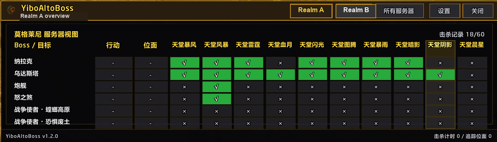

# YiboAltoBoss

YiboAltoBoss is a World of Warcraft addon for Mists of Pandaria Classic that tracks world boss weekly kills and Warbringer observations across your characters.

## Features

- Account-wide overview for MoP Classic world boss progress
- Per-character tracking for Sha of Anger, Galleon, Nalak, and Oondasta
- Warbringer observation tracking by zone and realm
- Minimap launcher with hover details
- Configurable overview and settings panels

## Included Libraries

- LibStub
- CallbackHandler-1.0
- LibDataBroker-1.1
- LibDBIcon-1.0

## Release Package

GitHub Releases and packaged builds exclude unused source artwork under `Media/Source/`.
